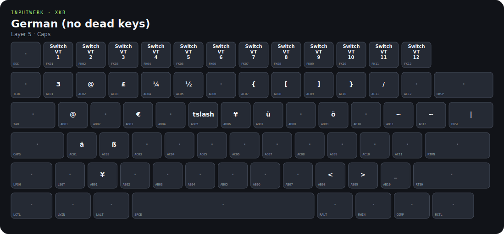

# inputwerk

Portable Linux keymap recipes for XKB, Wayland and desktop targets.

`inputwerk` is a Bun-based CLI for turning a complete `xkb_keymap` dump into
reusable XKB components. It validates the resulting RMLVO configuration with
libxkbcommon and installs it for desktop targets such as COSMIC.

The project currently ships the `amelie` profile. Its full keymap remains the
source of truth; generated component files are reproducible build artifacts.

[](https://sayore.github.io/inputwerk/)

**[Open the interactive keymap visualizer](https://sayore.github.io/inputwerk/)**
· [tracked standalone HTML](docs/index.html)

## Requirements

- [Bun](https://bun.sh/) 1.3 or newer
- `xkbcli` from libxkbcommon
- `sudo` only for `/etc/xkb` or `/usr/share/X11/xkb` installations

On Arch Linux, `xkbcli` is provided by `libxkbcommon`. On Debian-derived
systems, install `libxkbcommon-tools`.

## Quick start

```console
git clone https://github.com/sayore/inputwerk.git
cd inputwerk
bun run validate
bun run install:cosmic
```

Generate an interactive, standalone HTML visualization with all effective XKB
levels:

```console
bun run visualize
```

Open `dist/amelie-keymap.html` in any modern browser. Use the layer buttons,
number keys, or arrow keys to switch between the eight layers.

The default installation writes the generated components to `~/.config/xkb`,
backs up an existing COSMIC keyboard configuration, and writes:

```text
~/.config/cosmic/com.system76.CosmicComp/v1/xkb_config
```

Log out of COSMIC and back in after installation so the compositor starts with
the new keymap.

## Commands

| Command | Purpose |
| --- | --- |
| `bun run keymap validate` | Generate components and compile the RMLVO configuration with libxkbcommon |
| `bun run keymap visualize --output keymap.html` | Render an interactive standalone HTML visualizer |
| `bun run keymap visualize --output keymap.html --json keymap.json` | Render HTML and export reusable `inputwerk/keymap-v1` data |
| `bun run docs` | Refresh the tracked HTML, JSON, and SVG preview under `docs/` |
| `bun run keymap generate` | Generate component files under `generated/` |
| `bun run keymap install --target cosmic --scope user` | Install into `~/.config/xkb` and configure COSMIC |
| `bun run keymap install --target cosmic --scope etc` | Install into `/etc/xkb` with `sudo` |
| `bun run keymap install --target cosmic --scope system` | Install into `/usr/share/X11/xkb` with `sudo` |
| `bun run keymap import --source /path/to/map.xkb` | Replace the source map and validate it |
| `bun run keymap status` | Show source, COSMIC configuration, and installation status |

Use the `system` scope only as a fallback. Distribution package upgrades can
overwrite files below `/usr/share/X11/xkb`; the `user` and `etc` scopes are
safer.

## How it works

The checked-in [`keymaps/amelie.full.xkb`](keymaps/amelie.full.xkb) contains a
complete keymap rather than a standalone `xkb_symbols` variant. `inputwerk`
extracts its `keycodes`, `types`, `compatibility`, and `symbols` sections and
generates a matching rules file. COSMIC then loads the profile through:

```text
rules   = amelie
model   = amelie
layout  = amelie
variant = ""
options = none
```

Validation uses the same RMLVO resolution path instead of compiling only the
original monolithic file. This catches missing rules and component search-path
problems before installation.

## Web component

The visualizer is also available as the framework-independent
`<inputwerk-keymap>` custom element:

```html
<script type="module" src="./src/web/inputwerk-keymap.js"></script>
<inputwerk-keymap src="./keymap.json"></inputwerk-keymap>
```

The `src` document uses the versioned `inputwerk/keymap-v1` format produced by
`inputwerk visualize --json`. A parsed document can also be assigned directly:

```js
document.querySelector("inputwerk-keymap").data = keymapDocument;
```

The parser reads each key's assigned XKB type and limits displayed symbols to
that type's effective levels. This matters for full-map dumps that retain more
symbol entries than the assigned type can address.

Layer names in the header come from the map's dominant type. Hover or focus a
key to inspect its own XKB type, raw keysym, and effective modifier. For example,
the function-row `XF86Switch_VT_*` symbols are on numeric level 5 with the
`CTRL+ALT` type even though level 5 is named `Caps` by `AMY_8_LEVEL`.

## Standalone binary

Bun can compile the CLI and embed the full source map in one executable:

```console
bun run build:binary
./dist/inputwerk validate
```

The binary writes temporary generated components below the system temporary
directory. Installation destinations and COSMIC configuration remain the same
as when running from source.

## Project layout

```text
inputwerk/
├── keymaps/amelie.full.xkb  # source of truth
├── src/cli.ts               # CLI entry point
├── src/keymap.ts            # type-aware XKB parser
├── src/visualize.ts         # standalone HTML renderer
├── src/web/                 # reusable custom element
├── test/                    # Bun parser tests
├── docs/                    # tracked interactive visualizer and README preview
├── generated/               # reproducible output, ignored by Git
└── dist/                    # standalone binary, ignored by Git
```

## Development

```console
bun run validate
bun test
bun run visualize
bun run build:binary
./dist/inputwerk validate
```

Both validation paths should pass before publishing changes to the keymap or
generator.
